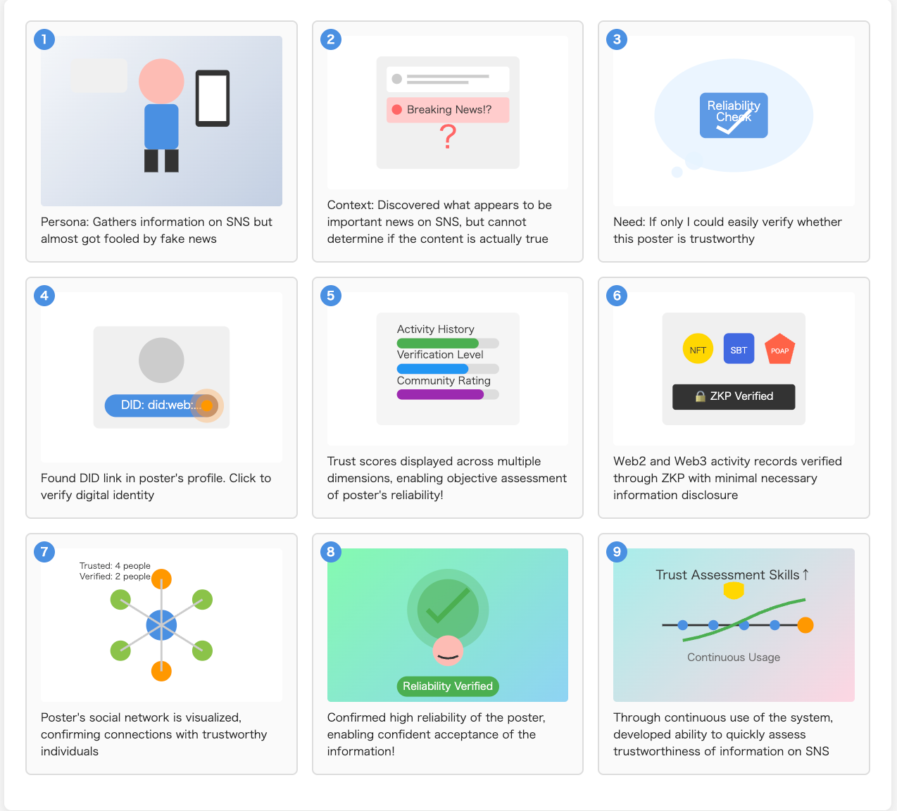
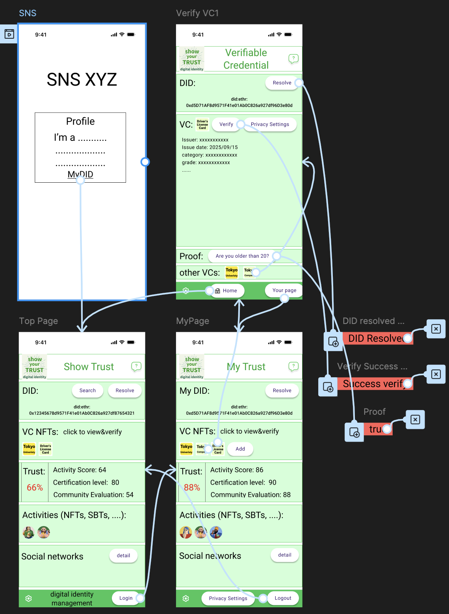

# Digital Identity -> Trust system: zkVC

## Global Scope

As written in [“Solving Web2 SNS Issues with Web3,”](https://note.com/nabe33/n/n2541b68c26ef) I, as a researcher, designer, and builder, am interested in resolving current SNS issues such as fake news, believing that “**digital identity**” is key. The crucial themes are how to control the identity of information publishers in digital worlds like SNS and demonstrate their **trust**. 

In the real world, we can (to a significant degree) judge whether someone is trustworthy based on whether they are a friend, an acquaintance, or a member of a certain organization. However, in the digital world of cyberspace, it is difficult to assess reliability because we often cannot identify who posted the information, and fake accounts even exist.

## Description of the current system

The above theme is a huge issue. I, therefore, concentrate on the little specific project at this development. I developed a system that shows someone’s trust by showing their DID (Decentralized Identity) and VCs (verifiable Credentials). 

The system also verifies that the DID owner is 20 years of age or older using ZKP.  Birthday recorded in driver’s license VC is a private input and Zk-proof the claim using Circom and SnarkJS (Plonk). By implementing this function, the system protects the privacy of VC.

The current development is a simple application, but I want to continue to develop the system that shows someone’s trust by showing DID and VCs, their Web2 activities and Web3 activities, and their social network.

Thus, the developed system, **zkVC**, is a part of a digital identity system that shows trust with privacy protection.

## Development process of the system

### Requirements

- Handling identity with decentralized SSI.
- Supports n:1 relationships with SNS accounts through some method (e.g., embedding within SNS accounts, linking DIDs to SNS user profiles).
- Uses DIDs as human identifiers. Supports n:1 relationships with people via DIDs.
- Utilizes W3C's DID and VC specifications.
- Users manage the scope of privacy disclosure themselves. Use ZKPs to avoid disclosing more information than necessary.
- Possess both identity as a unique key and identity born from social relationships (demonstrating experiences and achievements). The former uses DID. Any DID method is acceptable, but initially use blockchain addresses. The latter, in the Web3 world, refers to NFTs, SBTs, POAPs, etc. In the Web2 world, zkTLS is used to demonstrate Web2 activities. (not implemented at this version)
- To demonstrate relational identity, a social network of digital identities can be displayed.  (not implemented at this version)
- Trustworthiness is calculated and displayed (for each trustworthiness metric) based on the data held.  (not implemented at this version)
- Trustworthiness scores from other services can also be displayed.  (not implemented at this version)
- Features a user-friendly UI/UX based on human-centered design.

Technical requirements:
- DID and VC utilize [“ERC-1056: Ethereum Lightweight Identity”](https://eips.ethereum.org/EIPS/eip-1056) . The DID repository uses the ERC-1056 repository.
- VC linked to NFTs utilize [“ERC-7861: ERC-721 Verifiable Credential Extension”](https://eips.ethereum.org/EIPS/eip-7861) . VC are stored in a location inaccessible to anyone and can only be accessed through system verification and VC publication. (ERC 7861 is not implemented at this version)
- The frontend uses React. An API server is placed between the frontend and the contracts. The contract side uses Foundry.
- Tailwind CSS is used. (Alternatively, Material UI)
- This time, the age information contained within the VC is concealed using zero-knowledge proofs, proving only that the individual is 20 years of age or older.

### Human-Centered Development (UX Deisgn)

As a professional UX designer, I used a Human-Centered Design to set the following factors:

- **Vision**: Solve social media issues like fake news and fake accounts using Web3 technology and philosophy.
- **Purpose**: Focus on trustworthiness, demonstrating the reliability of social media information through human trustworthiness tied to digital identity.
- **Concept**: Easy to use and conveys trustworthiness.
- **Target Users**: Social media users. Individuals and society impacted by social media.
- **User Needs**: Target users utilize this system when they wish to verify the reliability of social media information.
- **Surface Design**: Use green as the theme color to convey trustworthiness. Employ a soft green to evoke approachability and ease of use. Text color is black. Use red as an accent color. Create a functional design.

### 9-panel UX storyboard



### Prototype design with Figma

According to the requirements, Human-Centered Design, and 9-panel UX storyboard, I used Figma to design the screen and some functions that must be implemented in the current development.

 

As I used the Figma MPC server to write React frontend code, the React code is poorly written and needs rewriting, but I couldn't do it this time. The design of React frontend, however, perfectly replicates Figma’s design.

## Specific Implementation of zkVC

### System Architecture

The zkVC system is built on a multi-layered architecture that combines Web2 and Web3 technologies to provide a comprehensive digital identity and trust verification platform:

```
┌─────────────────────────────────────────┐
│               Frontend (Web)            │
│        React + TypeScript + Vite        │
│         Tailwind CSS                    │
└─────────────────────────────────────────┘
                     │
┌─────────────────────────────────────────┐
│              API Server                 │
│           NestJS + Express              │
│     DID Resolution + VC Verification    │
│         ZK Proof Generation             │
└─────────────────────────────────────────┘
                     │
┌─────────────────────────────────────────┐
│            Blockchain Layer             │
│         EIP-1056 (EthrDID)              │
│      Ethereum Sepolia Testnet           │
│         Smart Contracts                 │
└─────────────────────────────────────────┘
                     │
┌─────────────────────────────────────────┐
│          ZK Circuit Layer               │
│        Circom + SnarkJS (Plonk)         │
│       Age Verification Circuits         │
│         Privacy-Preserving              │
└─────────────────────────────────────────┘
```

### Project Structure

```
zkp_vc/
├── api/                    # NestJS API Server
│   ├── src/
│   │   ├── app.controller.ts  # REST API endpoints
│   │   ├── app.service.ts     # Core business logic
│   │   └── main.ts           # Server bootstrap
│   └── package.json
├── web/                    # React Frontend
│   ├── src/
│   │   ├── topPage.tsx       # Main dashboard
│   │   ├── myPage.tsx        # User profile page
│   │   ├── verifyVC.tsx      # VC verification interface
│   │   └── main.tsx          # React entry point
│   └── package.json
├── web-controller/         # EIP-1056 Web Controller (you don't have to use it)
│   ├── src/
│   │   ├── App.tsx           # DID management interface
│   │   └── components/       # React components
│   └── package.json
├── contract/               # Smart Contracts
│   ├── script/
│   │   └── Verifier.sol      # ZK proof verifier contract
│   └── foundry.toml
├── circom/                 # Zero-Knowledge Circuits
│   ├── circuits/
│   │   └── ageCheck.circom   # Age verification circuit
│   └── work/                 # Generated circuit files
├── vc/                     # Verifiable Credentials
│   └── vc.json              # Sample driver's license VC
├── app/                    # Standalone Applications to check ZKP (you don't have to use it)
│   └── ageVerification.js   # CLI age verification tool
└── README.md
```

### Quick Start

#### Prerequisites
- Node.js (v18 or higher)
- npm or yarn
- Git
- circom and snarkjs

#### 1. Clone and Setup
```bash
git clone <repository-url>
cd zkp_vc
```

#### 2. API Server Setup

The API server provides functions of interacting with EIP1056 contract, treating local VC, and making a ZKP using Plonk. Web frontend uses these APIs.

```bash
cd api
npm install
npm run start:dev
# Server runs on http://localhost:3001
```

#### 3. Frontend Setup

This is the zkVC system. It requires API sever running.

```bash
cd web
npm install
npm run dev
# Frontend runs on http://localhost:5173
```

#### 4. EIP-1056 Web Controller Setup

This web-controller and the api server was created based on [did-vc published on GitHub](https://github.com/ka-sasaki-sti/did-vc) . It is a full-stack application implementing DID and VCs using EIP/ERC-1056.

You need to run this server when you want to issue DID document and check functions around DID and VC. Otherwise, you don't have to run this server.

```bash
cd web-controller
npm install
npm run dev
# It runs on http://localhost:3002
```

#### 5. Environment Configuration
Create `.env` files in the `api` and `app` directories:
```env
# api/.env and app/.env
RPC_URL=https://sepolia.infura.io/v3/YOUR_PROJECT_ID
PRIVATE_KEY=0x...your-private-key
CONTRACT_ADDRESS=0x...deployed-verifier-contract-address
```

#### 6. Zero-Knowledge Circuit Setup
circom/circuit/ageCheck.circom is a circuit to zk proof that the driver is older than 20 with private input of birthday and public input of today's date.

Output will be saved in a directory circom/work/ageCheck. verifyAge function of API sever uses this output to make ZKP.

```bash
cd circom
# Install circom and snarkjs globally if not already installed
npm install -g circom snarkjs

# Compile circuit
circom circuits/ageCheck.circom --r1cs --wasm --sym -o work/
# Generate trusted setup (for demo purposes)
snarkjs powersoftau new bn128 12 work/pot12_0000.ptau -v
# ... (complete trusted setup process)
```

#### 7. Other Directories
- contract directory provides a contract to verify driver's age with ZKP, using AgeVerifier.sol and Verifier.sol.
- app directory verifies that a user is at least 20 years old using ZKP, without revealing their exact birthdate. You don't have to use this directory. If you want to make a ZKP onchain using Verifier.sol, you can use 'ageVerifier.sol'.
- vc/vc.json is the VC the current system uses.
  
### Technical Details

#### Core Technologies

**Frontend Stack:**
- **React 18** with TypeScript for type-safe UI development
- **Vite** for fast development and build tooling
- **Tailwind CSS** for utility-first styling (web frontend)
- **Material-UI (MUI)** for consistent component design (web-controller)
- **Axios** for HTTP client communications

**Backend Stack:**
- **NestJS** framework for scalable Node.js applications
- **Express** as the underlying HTTP server
- **TypeScript** for type safety and modern JavaScript features

**Blockchain Integration:**
- **EIP-1056 (EthrDID)** for Ethereum-based Decentralized Identifiers
- **did-resolver** and **ethr-did-resolver** for DID resolution
- **ethers.js v6** for Ethereum blockchain interactions
- **Sepolia Testnet** for development and testing

**Zero-Knowledge Proofs:**
- **Circom** for arithmetic circuit development
- **SnarkJS** for proof generation and verification
- **PLONK** proving system for efficient proofs
- **Custom age verification circuit** for privacy-preserving age checks

#### Key Features

##### 1. Decentralized Identity Management
- **DID Creation**: Generate Ethereum-based DIDs using EIP-1056 standard
- **DID Resolution**: Resolve DIDs to their corresponding DID Documents
- **Cross-platform Compatibility**: Works with any EIP-1056 compatible system

##### 2. Verifiable Credential Processing
- **VC Parsing**: Support for JSON-LD formatted Verifiable Credentials
- **Schema Validation**: Validate VCs against expected schemas
- **Credential Display**: User-friendly presentation of credential data
- **Privacy Controls**: Selective disclosure of credential information

##### 3. Zero-Knowledge Age Verification
- **Private Input Processing**: Birthday from VC remains confidential
- **Public Proof Generation**: Proves age ≥ 20 without revealing exact age
- **Circuit Security**: Cryptographically secure age verification
- **On-chain Verification**: Optional smart contract verification (available but not required)

##### 4. Trust Scoring System (not implemented in the current system)
- **Multi-dimensional Assessment**: Evaluate trust across multiple criteria
- **Activity History**: Track and display user activity patterns
- **Verification Levels**: Show different levels of identity verification
- **Community Ratings**: Aggregate community-based trust scores

##### 5. Social Network Visualization (not implemented in the current system)
- **Connection Mapping**: Visualize trusted connections and relationships
- **Trust Propagation**: Leverage social proof for enhanced trust assessment
- **Network Analysis**: Analyze connection quality and trustworthiness

#### Security Considerations

- **Private Key Management**: Secure storage and handling of cryptographic keys
- **Zero-Knowledge Privacy**: No sensitive data disclosed during proof generation
- **Smart Contract Security**: Audited verification contracts (when used)
- **Input Validation**: Comprehensive validation of all user inputs
- **CORS Protection**: Proper cross-origin resource sharing configuration

#### Development Philosophy

The zkVC system follows a **privacy-first** approach where:
- Users maintain full control over their personal data
- Zero-knowledge proofs minimize information disclosure
- Decentralized architecture reduces single points of failure
- Open standards (W3C DID/VC) ensure interoperability
- Human-centered design prioritizes user experience

This implementation serves as a foundation for building trust networks in digital spaces while preserving individual privacy and autonomy.

